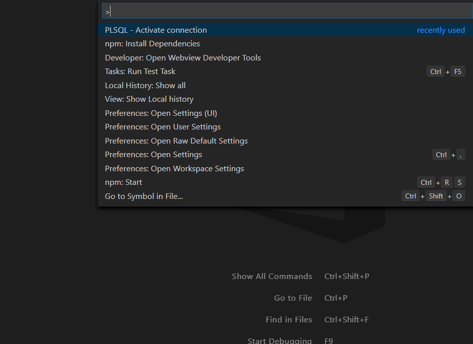
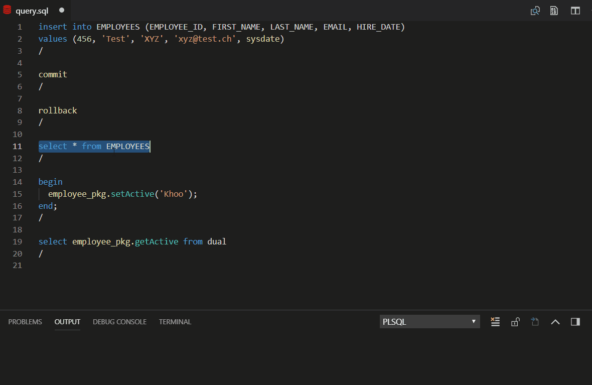

# PL/SQL (Oracle) for Visual Studio Code

This extension adds support for the PL/SQL (Oracle) to Visual Studio Code.

## Colorization
Full syntax highlight for PL/SQL files based on oracle-textmate-bundle

An advanced customization can be done by using an **extensionDependencies**, [follow this exemple](plsql-language-custom/xyz.plsql-language-custom-0.0.1)

## Go to Symbol
Navigate
  - to procedures, functions
  - to constants, variables, type, subtype, cursor (declared in spec/body part of a package)

## Go to Definition
Navigate to methods (procedures and functions) with some limitations :
- Go to a symbol (see Go to Symbol) in the same file
- Go to a symbol (see Go to Symbol) in another file whose name includes the package or method name.
   e.g.: *XXX_MyPackage.pkb or XXX_MyFunction.sql*

## Define search paths
Use the settings `plsql-language.searchPaths` to specify where to search.
- null (default) search in all workspaces.
- ${workspaceFolder}: limit search in current workspace
- ${workspaceFolder: _name_}: limit search by name of workspace
- ${workspaceFolder: _index_}: limit search by index of workspace
- _path_: limit search in this folder

You can specify multiple locations by using an array.
 e.g.: `["${workspaceFolder: pl}", "C:/Develop/MyProjects/Oracle"]`

## Documentation
Generate detailed documentation automatically for procedures and functions.

Use Ctrl+Space (like others snippets) when the caret is on an empty line,
above a function or a procedure declaration, a 'special' snippet is generated.
(with prefix __doc by default)

The default template is [here](snippets/pldoc.json). 
(don't modify this file, it'll be overwritten with the update of the extension !) 

        plsql-language.pldoc.path:   to define your own snippet and specify its location
        plsql-language.pldoc.author: to define the author.
        plsql-language.pldoc.enable: to disabled this feature

**To customize:** 
 - Create your own file pldoc.json. 
   Don't change the default file because it'll be overwritten the next time you update this extension
 - Define the path (folder only) to your custom file by using the setting *plsql-language.pldoc.path*

**Note** 
If documentation begins with /** (double stars), it'll appear in Signature, Hover, Completion.

## Completion
There is intelliSense for package members (autocompletion from package files).

You can also define your own completion for tables/fields.
An exemple is [here](snippets/plsql.completion.json). 
(don't use this file, it'll be overwritten with the update of the extension !) 

        plsql-language.completion.path: to specify its location

## Snippets
Some snippets available

        plsql-language.snippets.enable: to disabled snippets defined in this extension

## Note
For this extension works with .sql files you must change your settings (user or workspace) like this:

        "files.associations": {
           	"*.sql": "plsql"
        }

## Connection
You can configure a list of connection in settings and use the active one in your tasks (see below).
Use the command: `PLSQL - Activate connection` or click on status bar.

The oracle db connection feature is still under constuction, this is a preview version.
To activate it
        `plsql-language.oracleConnection.enable: true (false by default)`

You can run the current SQL statement (CTRL+ENTER).
If no selection, run current command delimited by character /
  Warning:
- Don't use or select character ; on a select statement.
- Don't select character /

You can also run an SQL statement from another extension like this:

        // To access db from another extension
        // Use active connection
        try {
             const result = await vscode.commands.executeCommand('plsql.executeCommand', {sql: 'SELECT LAST_NAME FROM EMPLOYEES'})
             vscode.window.showInformationMessage(JSON.stringify(result));
        } catch(err) {
             vscode.window.showErrorMessage(JSON.stringify(err));
        }
 

        // Or create a specific connection
        try {
            // with connection params
            // let _connection = await vscode.commands.executeCommand('plsql.createConnection', {user: 'hr', password: 'hr', connectString: 'localhost:1521/xe' })
            // or with a tag to find in setting of connections
            let _connection = await vscode.commands.executeCommand('plsql.createConnection', {tag: 'hr'})
            const result = await vscode.commands.executeCommand('plsql.executeCommand', {sql: 'SELECT LAST_NAME FROM EMPLOYEES', connection: _connection})
            vscode.window.showInformationMessage(JSON.stringify(result));
            await vscode.commands.executeCommand('plsql.removeConnection', {connection: _connection});
            _connection = null;
        } catch(err) {
            vscode.window.showErrorMessage(JSON.stringify(err));
        }

Prerequiste:
- Install Node.js from [nodejs.org](https://nodejs.org)

Notes:
- [node-oracledb](https://oracle.github.io/node-oracledb) is used externally to use pre-built [node-oracledb binary](https://github.com/oracle/node-oracledb/releases)
- `npm install oracledb` is automatically executed on the first activation (when using connection) and installed here:
        `.../.vscode/extensions/xyz.plsql-language-_version_\server-oracle\node_modules\oracledb`
- Please consult node-oracledb site to resolve issues when installation failed.
- [vscode extensions](https://code.visualstudio.com/docs/extensionAPI/patterns-and-principles#_can-i-use-native-nodejs-modules-with-my-extension)
don't supports binary node module. (This is the reason why command `npm install oracledb` is executed.)

Roadmap:
- [X] List of connections in settings.
- [X] Complete fields list in settings (connect as...)
- [X] Connect to DB
- [X] Execute SQL
- [ ] Run file as a script
- [ ] Auto-complete

## Compile / Task
You can compile a PLSQL package with sqlplus, create a task like this:

        {
                "version": "2.0.0",
                "tasks": [{
                        "label": "sqlplus",
                        // Run sqlplus
                        "command": "sqlplus",
                        // Alternative (see below)
                        // "command": "run_sqlplus.bat",

                        "args": ["username/password@sid", "@\"${file}\""]
                        // Alternative: use active connection defined in settings
                        // "args": [${config:plsql-language.connection.activeInfos}, "@\"${file}\""]
                }]
        }

To force sqlplus to complete, it is better to use a batch file like this:

        run_sqlplus.bat
                echo exit | echo show errors | sqlplus %1 %2

This will run sqlplus, output any errors, and then exit cleanly back to VS Code. 
Thanks to @mortenbra (issue [#5](https://github.com/zabel-xyz/plsql-language/issues/5))
